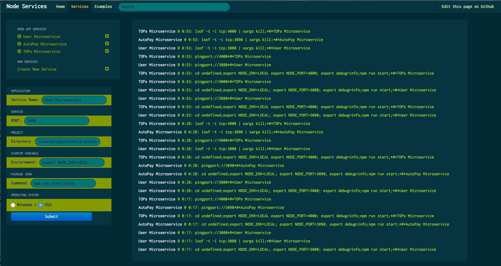

# microservicePortController - NASIR SAYED & NOAH WALLACE
# Version 0.0.1

This repository helps to all the developer to run the microservices from single web page. I'm using websocket to talk to system terminal. It create instance of each service to trace all the logs and report on the web page. All microservices or other NODE application are configuarable. It also support environment, port, location of the project directory and package.json command. 

I didn't used any heavy packages such as express, or static server. Everything's using local OS and native library of nodejs.

`download the repository`

run the `tsc` command if build folder didn't exists

configure all the apps in `root.js` array`

goto the `localhost:8125/` and start or stop the services in single page.

